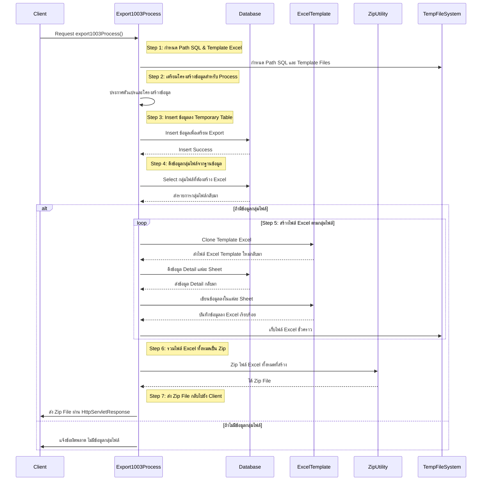
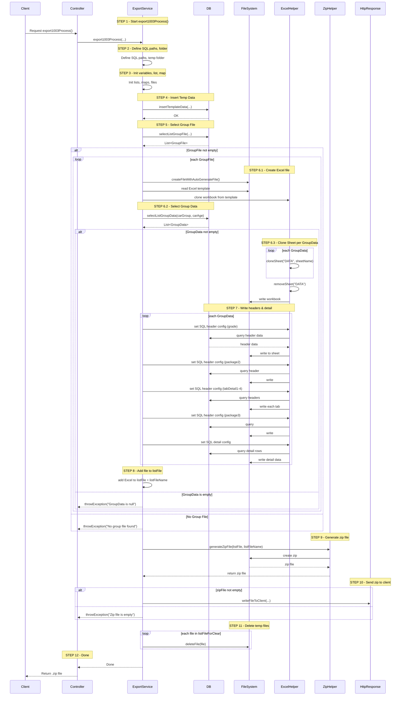

ฟังก์ชัน `1003(...)` เป็นเมธอดที่ทำหน้าที่ **Export Excel Template แบบ Dynamic** ตาม Group และ Data ที่กำหนด พร้อมทั้งเขียนข้อมูล Header และ Detail จาก SQL File แล้ว **ZIP ไฟล์** และส่งกลับให้ Client ผ่าน `HttpServletResponse`

#

### 📌 Parameters:
```java
HttpServletResponse theResponse       // ใช้สำหรับเขียนไฟล์กลับไปยัง Client
String theTemplateCode               // Template รหัส (1003)
String theCreateBy                   // ผู้สร้างไฟล์
String thePgSaleCode                 // รหัสผู้ขาย
Timestamp theEffectDt               // วันที่เริ่มต้น
Timestamp theExpiryDt               // วันที่สิ้นสุด
```

#

## 🔍 อธิบายโดยละเอียดตามโค้ด

#

### 1. 🔧 เตรียม Path SQL & Template
```java
String w_sql_header_grade = ".../sql_header_data/header_grade";
...
String w_sql_select_dataDetail = ".../sql_select_data";
String w_root_gen_file = "ex-template-ev/1003/" + theCreateBy;
```
- ตั้งค่าพาธไฟล์ SQL ที่ใช้โหลดข้อมูล Header ต่าง ๆ
- `w_root_gen_file` คือ root folder สำหรับเก็บไฟล์ Excel ชั่วคราว (ต่อผู้ใช้งาน)

#

### 2. 🧺 เตรียมโครงสร้างข้อมูล และไฟล์ที่จะใช้ในกระบวนการ
```java
List<IBSTempInsGroupDataExpTemplateTO> w_listGroupFile = new ArrayList<>();
List<File> w_listFile = new ArrayList<>();
...
HashMap<String, Object> w_hashValue = null;
```
- เตรียม List สำหรับ Group Data (แบ่งกลุ่มไฟล์), ไฟล์ทั้งหมด, และ Map สำหรับเก็บค่าต่าง ๆ ที่ใช้แทนใน SQL (เช่น `{carGroup}`)

#

### 3. 📁 โหลด Template ไฟล์ .xlsx
```java
File w_fileExcelTemplate = new File(..., I_PATH_XLSX_BEGIN_1003EV);
```
- โหลด Template Excel (ที่มี Sheet "DATA" เตรียมไว้)

#

### 4. 🧩 Insert Data ลง Temp Table
```java
this.insertTemplateData(...);
```
- นำข้อมูลจาก Oracle หรือ Data Source อื่น ๆ ไป Insert ลง Table Temp ตาม Template 1003

#

### 5. 🧵 ดึงข้อมูลกลุ่มไฟล์ (Group File)
```java
w_listGroupFile = this.selectListGroupFile(...);
```
- เพื่อแบ่ง Excel แยกตาม Group เช่น Car Group, Car Age ฯลฯ

#

### 6. 🔁 Loop Group File (สร้าง Excel แยกตาม Group)
```java
for (IBSTempInsGroupDataExpTemplateTO w_loopGrpFile : w_listGroupFile) {
```
- วนลูปแต่ละกลุ่ม เช่น รถยนต์อายุ 1-3 ปี, 4-7 ปี ฯลฯ

#

### 7. 🧫 Clone Sheet และตั้งชื่อ
```java
w_workBook.cloneSheet(..., w_sheetNm);
w_workBook.removeSheetAt(... "DATA");
```
- Clone Sheet "DATA" แล้วตั้งชื่อใหม่ตามชื่อกลุ่ม
- ลบ Sheet "DATA" ต้นแบบทิ้งเมื่อไม่ใช้แล้ว

#

### 8. 📄 เขียน Header และ Detail ลง Sheet
```java
this.setFolderForSqlQueryDynamicHeader(...);
this.setConfigDynamicHeader(...);
new IBSHelperDBForDynamicStyleMsExcel().excuteDHeader(...);
```
- เขียนหัวตาราง / รายละเอียด ด้วยการ
  - อ่าน SQL Template (พร้อม `HashMap` แทนค่าตัวแปร)
  - คอนฟิก Style และ Cell
  - เขียนลงใน Sheet ที่ clone

ทำซ้ำตาม Header ทั้งหมด เช่น:
- DT_DP_HEAD1 = Grade
- DT_DP_HEAD2 = Package
- DT_DP_HEAD3 = Summary
- Tab Detail 1-4 = รายละเอียดเงื่อนไข ฯลฯ
- Select Data Detail = รายการข้อมูล

#

### 9. 📦 รวมไฟล์ Excel แต่ละกลุ่ม
```java
w_listFile.add(w_fileExcelOutput);
w_listFileName.add(w_loopGrpFile.getTmp_group_data() + ".xlsx");
```
- เก็บไฟล์ไว้เพื่อ Zip

#

### 10. 🗜️ สร้าง ZIP ไฟล์
```java
this.helperFileZip.generateZipFile(w_listFile, w_listFileName, (theZipFile) -> {
    this.helperFile.copyFile(theZipFile, w_zipFile);
});
```
- สร้าง ZIP และก็อปปี้ผลลัพธ์เก็บไว้ใน `w_zipFile`

#

### 11. 📤 ส่งกลับให้ Client
```java
this.helperHttp.writeFileToClient(..., w_zipFile.length(), new FileInputStream(w_zipFile));
```
- ส่งไฟล์ `.zip` กลับไปที่ Client ผ่าน `HttpServletResponse`

#

### 12. 🧹 ล้างไฟล์ Temp
```java
for (...) {
    this.helperFile.deleteFile(w_listFileForClear.get(i));
}
```
- ลบไฟล์ Excel ชั่วคราวทั้งหมด (เพื่อไม่ให้รก Disk)

#

### 13. ❌ Catch Exception
```java
catch (Exception e) {
    w_fileInput.close(); ...
    IBSHelperException.throwException(e.getMessage());
}
```
- จัดการปิด Resource และโยน Error ถ้ามีข้อผิดพลาดเกิดขึ้น

#


 


#
## ✅ Flowchart Diagram


#

## ✅ สรุป Flow:

1. Insert Data → Select Group
2. Loop Group:
   - Clone Sheet
   - เขียน Header + Detail จาก SQL
   - สร้าง Excel ต่อ Group
3. รวมทั้งหมดเข้า ZIP
4. ส่งกลับ Client
5. ลบไฟล์ชั่วคราว
