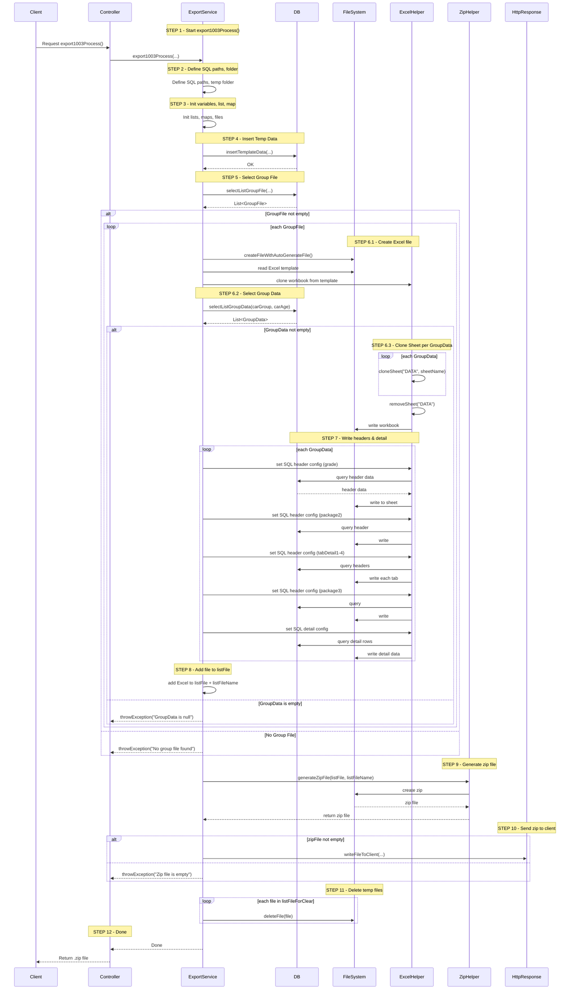
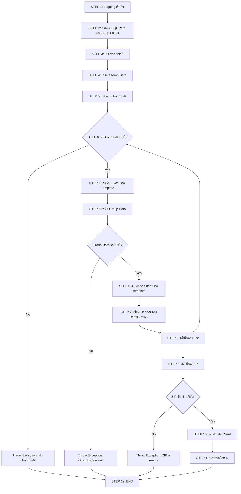

## 🔁 Method `1003(...)`
ฟังก์ชันทำหน้าที่ **ดึงข้อมูลจากฐานข้อมูล → สร้าง Excel ตาม Template → เขียนข้อมูลลง Excel → Zip → ส่งกลับ Client → ลบไฟล์ชั่วคราว**

#

## ✅ INPUT Parameters:

```java
HttpServletResponse theResponse,
String theTemplateCode,
String theCreateBy,
String thePgSaleCode,
Timestamp theEffectDt,
Timestamp theExpiryDt
```
#
| ชื่อ | คำอธิบาย |
|------|----------|
| `theResponse` | ใช้สำหรับเขียน response กลับไปยัง Client (download ไฟล์) |
| `theTemplateCode` | โค้ดของ Template (เช่น “1003”) |
| `theCreateBy` | ผู้สร้างรายการ Export |
| `thePgSaleCode` | Package Code |
| `theEffectDt` | วันที่เริ่มต้น |
| `theExpiryDt` | วันที่สิ้นสุด |

#

## 🔢 STEP 1: Logging เริ่มต้น

```java
logger.info("START export1003Process()");
```

> Log ว่าเริ่มต้น process นี้แล้ว

#

## 🗂️ STEP 2: Define Path ของ SQL และ Template

```java
String w_sql_header_grade = ".../header_grade";
String w_sql_header_package2 = ".../header_package2";
...
String w_sql_select_dataDetail = ".../sql_select_data";
String w_root_gen_file = "ex-template-ev/1003/" + theCreateBy;
```

> กำหนด path ต่าง ๆ สำหรับโหลด SQL และเก็บไฟล์ Excel ชั่วคราว

#

## 📦 STEP 3: ประกาศตัวแปรที่ใช้

```java
List<IBSTempInsGroupDataExpTemplateTO> w_listGroupFile = new ArrayList<>();
...
HashMap<String, Object> w_hashValue = null;
...
File w_fileExcelTemplate = new File(this.resourceFolderOfSQL.getFile(), I_PATH_XLSX_BEGIN_1003EV);
```

> ประกาศ List, Map, File สำหรับใช้ใน process

#

## 🧩 STEP 4: เตรียมข้อมูล (Insert ลง Temp Table)

```java
this.insertTemplateData(w_template_code, theCreateBy, thePgSaleCode, theEffectDt, theExpiryDt, I_PATH_SQL_ROOT_TEMP_EV);
```

> ดึงข้อมูลที่ต้อง Export → Insert ลง Temporary Table (เพื่อเตรียมใช้ในขั้นตอนต่อไป)

#

## 📁 STEP 5: ดึง Group File ที่จะ Export

```java
w_listGroupFile = this.selectListGroupFile(...);
```

> ดึงรายการ Group ของข้อมูลที่ต้อง Export ซึ่งจะแบ่งตาม car group/car age เป็นต้น

#

## 🔁 STEP 6: วนลูปกลุ่มไฟล์ → สร้าง Excel

```java
for (IBSTempInsGroupDataExpTemplateTO w_loopGrpFile : w_listGroupFile) {
```

ภายในลูปนี้จะมีหลายขั้นย่อย:

#

### 🆕 STEP 6.1: สร้างไฟล์ Excel จาก Template

```java
w_fileExcelTemplateOut = this.helperFile.createFileWithAutoGenerateFile(w_root_gen_file);
w_fileInput = new FileInputStream(w_fileExcelTemplate);
w_fileOut = new FileOutputStream(w_fileExcelTemplateOut);
w_workBook = new XSSFWorkbook(w_fileInput);
```

> Clone Template Excel แล้วเตรียม Workbook

#

### 🔧 STEP 6.2: ดึง Group Data ภายใน Group File

```java
w_hashValue = new HashMap<>();
this.addHashMap(w_hashValue, "{carGroup}", w_loopGrpFile.getTmp_value_1());
this.addHashMap(w_hashValue, "{carAge}", w_loopGrpFile.getTmp_value_2());

w_listGroupData = this.selectListGroupData(...);
```

> ดึงข้อมูลกลุ่มย่อย ๆ ที่จะใช้สร้างแต่ละ Sheet

#

### 📄 STEP 6.3: วนลูปแต่ละ Group → Clone Sheet “DATA”

```java
w_workBook.cloneSheet(w_workBook.getSheetIndex("DATA"), w_sheetNm);
...
w_workBook.removeSheetAt(w_workBook.getSheetIndex("DATA"));
w_workBook.write(w_fileOut);
```

> สร้าง Sheet ตามชื่อที่กำหนด และลบต้นฉบับ “DATA” ที่ clone มา

#

## ✍️ STEP 7: เขียนข้อมูล Header และ Detail ลง Excel

### 🧠 สร้าง Object สำหรับ Dynamic Write

```java
IBSHelperDBForDynamicStyleMsExcelInputTO w_inputDynamicStyleTO = new IBSHelperDBForDynamicStyleMsExcelInputTO();
w_inputDynamicStyleTO.setDataSourceForRead(...);
...
```

> เตรียม input object สำหรับการเขียนแบบ Dynamic

#

### 🔁 STEP 7.1: วนลูปแต่ละ Group Data แล้วเขียนข้อมูลลง Sheet

```java
for (IBSTempInsGroupDataExpTemplateTO w_loopTO : w_listGroupData) {
```

ภายในลูปจะมีการเรียก method แบบเดิม ๆ หลายรอบ ดังนี้:

| ชื่อ Sheet Section | ใช้ SQL จาก | เขียนลง Excel ที่ตำแหน่ง Row |
|--------------------|-------------|-------------------------------|
| Grade              | `header_grade` | row 2 |
| Package 2          | `header_package2` | row 4 |
| Tab Detail 1       | `header_tabDetail1` | row 6 |
| Tab Detail 2       | `header_tabDetail2` | row 7 |
| Tab Detail 3       | `header_tabDetail3` | row 8 |
| Tab Detail 4       | `header_tabDetail4` | row 9 |
| Package 3          | `header_package3` | row 12 |
| Data Detail        | `sql_select_data` | row 13 (มีข้อมูลหลายแถว) |

> ทุก step จะใช้ method:
```java
this.setFolderForSqlQueryDynamicHeader(...)
this.setStyleConfigHeader(...)
this.setConfigDynamicHeader(...)
new IBSHelperDBForDynamicStyleMsExcel().excuteDHeader(...)
```

#

## 📦 STEP 8: บันทึกไฟล์ลง List สำหรับ Zip

```java
w_listFile.add(w_fileExcelOutput);
w_listFileName.add(w_loopGrpFile.getTmp_group_data() + ".xlsx");
```

> เก็บไฟล์ที่เขียนเสร็จแล้ว ลง List รอ Zip

#

## 📚 STEP 9: สร้างไฟล์ Zip

```java
this.helperFileZip.generateZipFile(w_listFile, w_listFileName, (theZipFile) -> {
	this.helperFile.copyFile(theZipFile, w_zipFile);
});
```

> Zip ไฟล์ทั้งหมดที่สร้าง แล้ว copy ไปยังตัวแปร `w_zipFile`

#

## 📤 STEP 10: ส่ง Zip กลับ Client

```java
this.helperHttp.writeFileToClient(..., new FileInputStream(w_zipFile));
```

> ให้ Client โหลดไฟล์ `.zip`

#

## 🧹 STEP 11: ลบไฟล์ชั่วคราว

```java
for (int i = 0; i < w_listFileForClear.size(); i++) {
	this.helperFile.deleteFile(w_listFileForClear.get(i));
}
```

> เคลียร์ไฟล์ `.xlsx` ชั่วคราวที่ไม่จำเป็น

#

## ❗ STEP 12: จัดการ Exception

```java
if (w_fileInput != null) w_fileInput.close();
...
IBSHelperException.throwException(e.getMessage());
```

> ปิด resource และโยน exception ถ้ามี error
#
### 🧩 Class
- `ExportService` (ตัวหลักที่ประมวลผล)
- `IBSTempInsGroupDataExpTemplateTO` (ตัวแทน Group Data)
- `IBSHelperDBForDynamicStyleMsExcel` (ช่วยจัดการ Excel)
- `HelperFile`, `HelperHttp`, `HelperZipFile` (ช่วยจัดการไฟล์, HTTP, ZIP)

---

### 🧩 UML Class Diagram

```mermaid
classDiagram
    class ExportService {
        +export1003Process(response: HttpServletResponse, templateCode: String, createBy: String, pgSaleCode: String, effectDt: Timestamp, expiryDt: Timestamp)
        -insertTemplateData(...)
        -selectListGroupFile(...)
        -selectListGroupData(...)
        -setFolderForSqlQueryDynamicHeader(...)
        -setStyleConfigHeader(...)
        -setConfigDynamicHeader(...)
    }

    class IBSTempInsGroupDataExpTemplateTO {
        +tmp_group_data: String
        +tmp_value_1: String
        +tmp_value_2: String
        +tmp_pg_sale_code: String
    }

    class IBSHelperDBForDynamicStyleMsExcel {
        +excuteDHeader(input: IBSHelperDBForDynamicStyleMsExcelInputTO): File
    }

    class IBSHelperDBForDynamicStyleMsExcelInputTO {
        +setDataSourceForRead(DataSource)
        +setFileExcel(File)
        +setHelperFile(HelperFile)
        +setHelperFileDBEXF(Object)
    }

    class HelperFile {
        +createFileWithAutoGenerateFile(path: String): File
        +copyFile(source: File, target: File)
        +deleteFile(file: File)
    }

    class HelperHttp {
        +writeFileToClient(response, downloadFlag, fileName, mimeType, length, inputStream)
    }

    class HelperZipFile {
        +generateZipFile(fileList: List<File>, fileNames: List<String>, callback: Function)
    }

    ExportService --> IBSTempInsGroupDataExpTemplateTO : uses
    ExportService --> IBSHelperDBForDynamicStyleMsExcel : writes
    ExportService --> IBSHelperDBForDynamicStyleMsExcelInputTO : configures
    ExportService --> HelperFile : file ops
    ExportService --> HelperHttp : send response
    ExportService --> HelperZipFile : zip files
```


#

### 🧠 Diagram นี้แสดงอะไร?

| คลาส | บทบาท |
|------|--------|
| `ExportService` | Logic หลักของการ Export ไฟล์ |
| `IBSTempInsGroupDataExpTemplateTO` | ตัวแทนข้อมูล Group สำหรับการสร้าง Sheet |
| `IBSHelperDBForDynamicStyleMsExcel` | ตัวช่วยเขียน Excel จาก SQL |
| `HelperFile` | จัดการไฟล์ชั่วคราว |
| `HelperHttp` | ส่งไฟล์กลับ Client |
| `HelperZipFile` | ZIP หลายไฟล์เป็น 1 ZIP |
#
## 📌 Sequence Diagram:


##
## ✅ Flowchart Diagram:

  

##

## 📌 สรุปขั้นตอน

| ขั้น | รายละเอียด |
|------|------------|
| 1️⃣ | Logging เริ่มต้น |
| 2️⃣ | กำหนด Path SQL และ Temp Folder |
| 3️⃣ | เตรียมตัวแปร |
| 4️⃣ | Insert ข้อมูล Temp |
| 5️⃣ | ดึง Group ของไฟล์ที่ต้อง Export |
| 6️⃣ | วนลูป Group File → Clone Excel จาก Template |
| 7️⃣ | วนลูป Group Data → เขียน Header & Detail |
| 8️⃣ | เก็บไฟล์ลง List |
| 9️⃣ | Zip ไฟล์ |
| 🔟 | ส่งไฟล์ให้ Client |
| 🔁 | ลบไฟล์ชั่วคราว |
| ⚠️ | จัดการ Exception |
#
