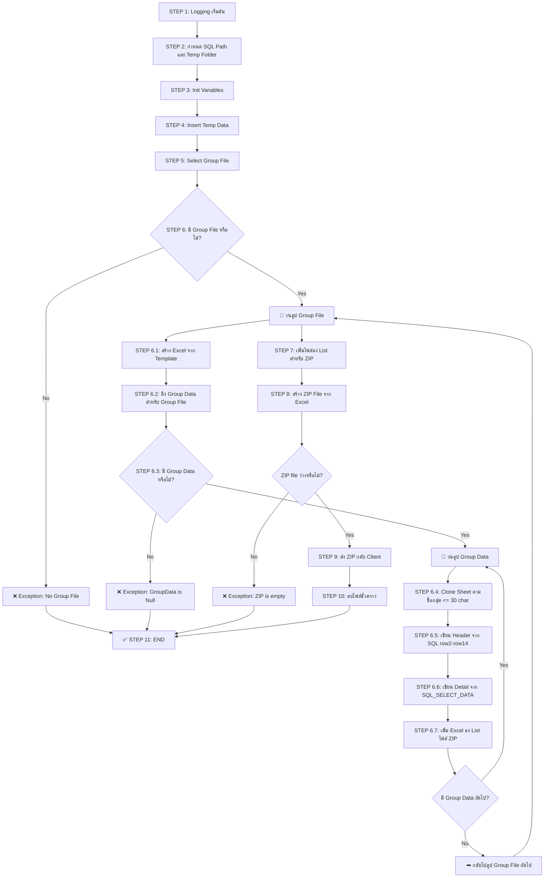

```mermaid
flowchart TD
    %% Logging & Init
    A1[STEP 1: Logging เริ่มต้น] --> A2[STEP 2: กำหนด SQL Path และ Temp Folder]
    A2 --> A3[STEP 3: Init Variables]
    A3 --> A4[STEP 4: Insert Temp Data]
    A4 --> A5[STEP 5: Select Group File]
    
    %% Check Group File
    A5 --> A6{STEP 6: มี Group File หรือไม่?}
    A6 -- No --> AE1[❌ Exception: No Group File]
    AE1 --> AE[🔚 END]

    %% Loop Group File
    A6 -- Yes --> B0[🔁 วนลูป Group File]
    B0 --> B1[STEP 6.1: สร้าง Excel จาก Template]
    B1 --> B2[STEP 6.2: ดึง Group Data สำหรับ Group File]

    %% Check Group Data
    B2 --> B3{STEP 6.3: มี Group Data หรือไม่?}
    B3 -- No --> AE2[❌ Exception: GroupData is Null]
    AE2 --> AE
    B3 -- Yes --> C0[🔁 วนลูป Group Data]

    %% Loop Group Data
    C0 --> C1[STEP 6.4: Clone Sheet ตามชื่อกลุ่ม <= 30 char]
    C1 --> C2[STEP 6.5: เขียน Header จาก SQL row2-row14]
    C2 --> C3[STEP 6.6: เขียน Detail จาก SQL_SELECT_DATA]
    C3 --> C4[STEP 6.7: เพิ่ม Excel ลง List ไฟล์ ZIP]

    %% Loop Back
    C4 --> C5{มี Group Data ถัดไป?}
    C5 -- Yes --> C0
    C5 -- No --> B3a[⬅ กลับไปลูป Group File ถัดไป]

    %% Back to Group File Loop
    B3a --> B0
    B0 --> D1[STEP 7: เพิ่มไฟล์ลง List สำหรับ ZIP]

    %% สร้าง ZIP
    D1 --> E1[STEP 8: สร้าง ZIP File จาก Excel]
    E1 --> E2{ZIP file ว่างหรือไม่?}
    E2 -- No --> AE3[❌ Exception: ZIP is empty] --> AE
    E2 -- Yes --> E3[STEP 9: ส่ง ZIP กลับ Client]
    E3 --> E4[STEP 10: ลบไฟล์ชั่วคราว]
    E4 --> AE[✅ STEP 11: END]


```
