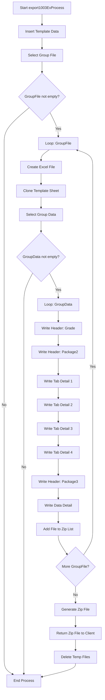

```mermaid
flowchart TD
    Start["Start export1003EvProcess"]
    InsertData["Insert Template Data"]
    SelectGroupFile["Select Group File"]
    CheckGroup{"GroupFile not empty?"}
    LoopGroupFile["Loop: GroupFile"]
    CreateExcel["Create Excel File"]
    CloneSheet["Clone Template Sheet"]
    SelectGroupData["Select Group Data"]
    CheckGroupData{"GroupData not empty?"}
    LoopGroupData["Loop: GroupData"]
    WriteHeader1["Write Header: Grade"]
    WriteHeader2["Write Header: Package2"]
    WriteTab1["Write Tab Detail 1"]
    WriteTab2["Write Tab Detail 2"]
    WriteTab3["Write Tab Detail 3"]
    WriteTab4["Write Tab Detail 4"]
    WritePackage3["Write Header: Package3"]
    WriteDetail["Write Data Detail"]
    AddToZip["Add File to Zip List"]
    CheckNextGroup{"More GroupFile?"}
    GenerateZip["Generate Zip File"]
    ReturnFile["Return Zip File to Client"]
    DeleteTemp["Delete Temp Files"]
    End["End Process"]

    %% Flow เส้นหลัก
    Start --> InsertData
    InsertData --> SelectGroupFile
    SelectGroupFile --> CheckGroup
    CheckGroup -- Yes --> LoopGroupFile
    CheckGroup -- No --> End

    LoopGroupFile --> CreateExcel
    CreateExcel --> CloneSheet
    CloneSheet --> SelectGroupData
    SelectGroupData --> CheckGroupData
    CheckGroupData -- Yes --> LoopGroupData
    CheckGroupData -- No --> End

    LoopGroupData --> WriteHeader1
    WriteHeader1 --> WriteHeader2
    WriteHeader2 --> WriteTab1
    WriteTab1 --> WriteTab2
    WriteTab2 --> WriteTab3
    WriteTab3 --> WriteTab4
    WriteTab4 --> WritePackage3
    WritePackage3 --> WriteDetail
    WriteDetail --> AddToZip

    AddToZip --> CheckNextGroup
    CheckNextGroup -- Yes --> LoopGroupFile
    CheckNextGroup -- No --> GenerateZip

    GenerateZip --> ReturnFile --> DeleteTemp --> End


```
