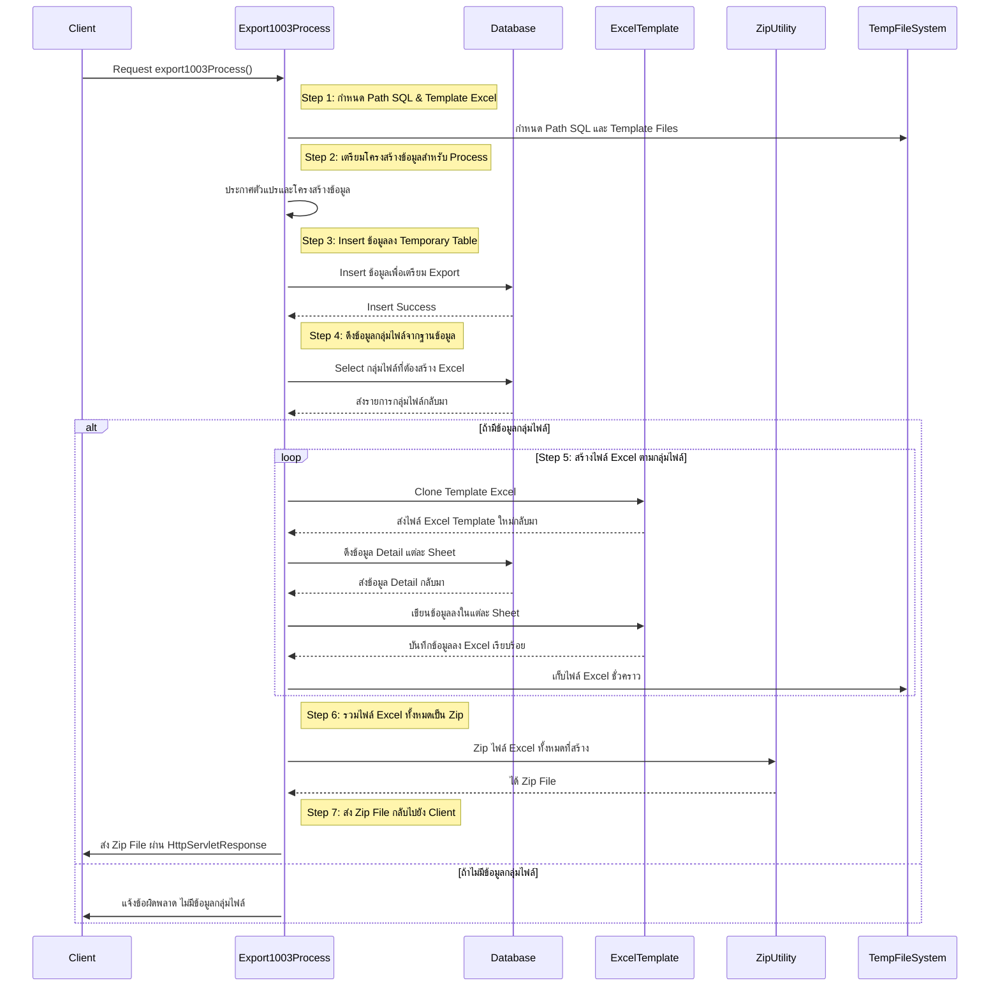
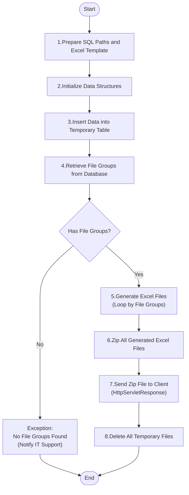

 
## 📌 Sequence Diagram: export1003Process

```mermaid
sequenceDiagram
participant Client
participant Export1003Process
participant Database
participant ExcelTemplate
participant ZipUtility
participant TempFileSystem

Client->>Export1003Process: Request export1003Process()
activate Export1003Process

Note right of Export1003Process: Step 1: กำหนด Path SQL & Template Excel
Export1003Process->>TempFileSystem: กำหนด Path SQL และ Template Files

Note right of Export1003Process: Step 2: เตรียมโครงสร้างข้อมูลสำหรับ Process
Export1003Process->>Export1003Process: ประกาศตัวแปรและโครงสร้างข้อมูล

Note right of Export1003Process: Step 3: Insert ข้อมูลลง Temporary Table
Export1003Process->>Database: Insert ข้อมูลเพื่อเตรียม Export
Database-->>Export1003Process: Insert Success

Note right of Export1003Process: Step 4: ดึงข้อมูลกลุ่มไฟล์จากฐานข้อมูล
Export1003Process->>Database: Select กลุ่มไฟล์ที่ต้องสร้าง Excel
Database-->>Export1003Process: ส่งรายการกลุ่มไฟล์กลับมา

alt ถ้ามีข้อมูลกลุ่มไฟล์
    loop Step 5: สร้างไฟล์ Excel ตามกลุ่มไฟล์
        Export1003Process->>ExcelTemplate: Clone Template Excel
        ExcelTemplate-->>Export1003Process: ส่งไฟล์ Excel Template ใหม่กลับมา
        Export1003Process->>Database: ดึงข้อมูล Detail แต่ละ Sheet
        Database-->>Export1003Process: ส่งข้อมูล Detail กลับมา
        Export1003Process->>ExcelTemplate: เขียนข้อมูลลงในแต่ละ Sheet
        ExcelTemplate-->>Export1003Process: บันทึกข้อมูลลง Excel เรียบร้อย
        Export1003Process->>TempFileSystem: เก็บไฟล์ Excel ชั่วคราว
    end

    Note right of Export1003Process: Step 6: รวมไฟล์ Excel ทั้งหมดเป็น Zip
    Export1003Process->>ZipUtility: Zip ไฟล์ Excel ทั้งหมดที่สร้าง
    ZipUtility-->>Export1003Process: ได้ Zip File

    Note right of Export1003Process: Step 7: ส่ง Zip File กลับไปยัง Client
    Export1003Process->>Client: ส่ง Zip File ผ่าน HttpServletResponse
else ถ้าไม่มีข้อมูลกลุ่มไฟล์
    Export1003Process->>Client: แจ้งข้อผิดพลาด ไม่มีข้อมูลกลุ่มไฟล์
end
 
 

```
## 📌 Flow Chart: export1003Process

```mermaid
graph TD;
    Start([Start]) --> Step1;
    Step1["1.Prepare SQL Paths and Excel Template"] --> Step2;
    Step2["2.Initialize Data Structures"] --> Step3;
    Step3["3.Insert Data into Temporary Table"] --> Step4;
    Step4["4.Retrieve File Groups from Database"] --> Step5{"Has File Groups?"};

    Step5 -->|Yes| Step6["5.Generate Excel Files<br>(Loop by File Groups)"];
    Step5 -->|No| Exception["Exception:<br>No File Groups Found<br>(Notify IT Support)"];

    Exception --> End([End]);

    Step6 --> Step7["6.Zip All Generated Excel Files"];
    Step7 --> Step8["7.Send Zip File to Client<br>(HttpServletResponse)"];
    Step8 --> Step9["8.Delete All Temporary Files"];
    Step9 --> End;

```
