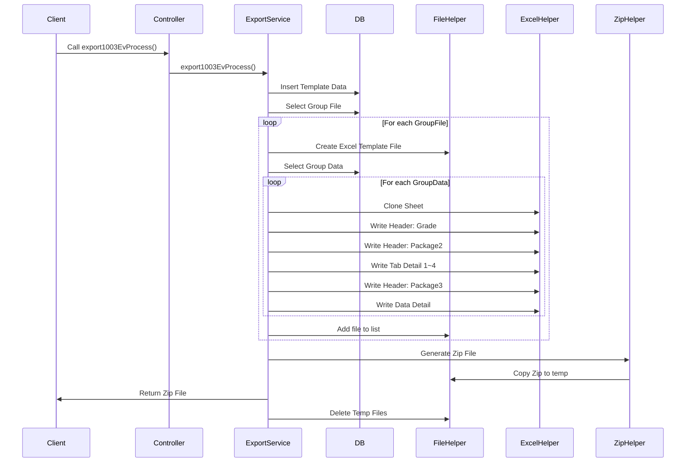

```mermaid
sequenceDiagram
    participant Client
    participant Controller
    participant ExportService
    participant DB
    participant FileHelper
    participant ExcelHelper
    participant ZipHelper

    Client->>Controller: Call export1003EvProcess()
    Controller->>ExportService: export1003EvProcess()
    ExportService->>DB: Insert Template Data
    ExportService->>DB: Select Group File
    loop For each GroupFile
        ExportService->>FileHelper: Create Excel Template File
        ExportService->>DB: Select Group Data
        loop For each GroupData
            ExportService->>ExcelHelper: Clone Sheet
            ExportService->>ExcelHelper: Write Header: Grade
            ExportService->>ExcelHelper: Write Header: Package2
            ExportService->>ExcelHelper: Write Tab Detail 1~4
            ExportService->>ExcelHelper: Write Header: Package3
            ExportService->>ExcelHelper: Write Data Detail
        end
        ExportService->>FileHelper: Add file to list
    end
    ExportService->>ZipHelper: Generate Zip File
    ZipHelper->>FileHelper: Copy Zip to temp
    ExportService->>Client: Return Zip File
    ExportService->>FileHelper: Delete Temp Files
```
