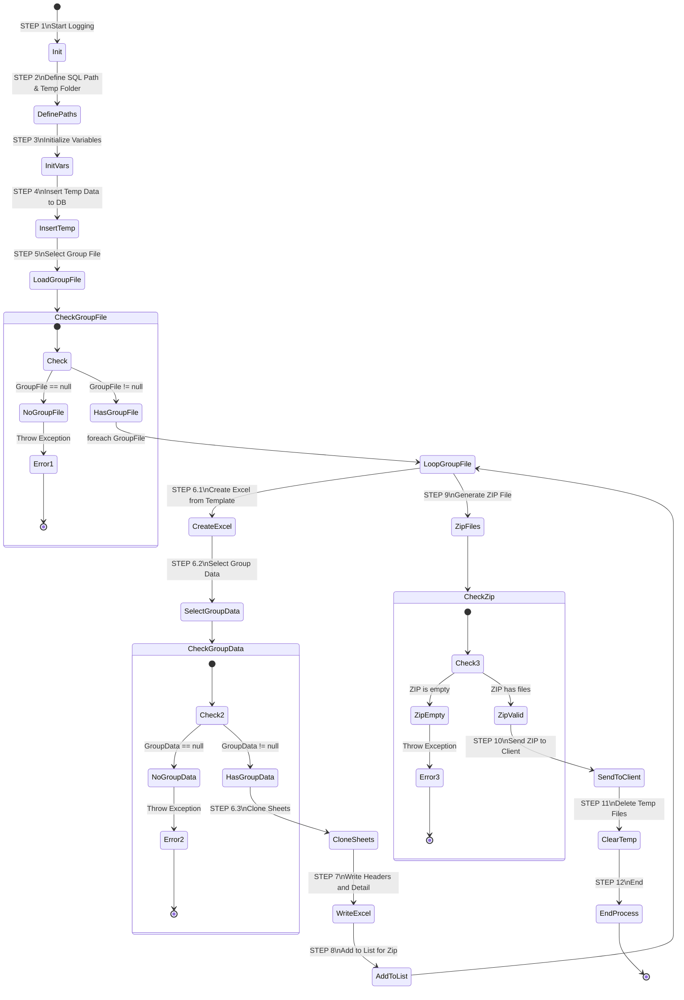

 
#UML Activity Diagram for 1003(...) 

---
title: Activity Diagram - export1003Process()
---

```mermaid 
stateDiagram-v2
    [*] --> Init : STEP 1\nStart Logging
    Init --> DefinePaths : STEP 2\nDefine SQL Path & Temp Folder
    DefinePaths --> InitVars : STEP 3\nInitialize Variables
    InitVars --> InsertTemp : STEP 4\nInsert Temp Data to DB
    InsertTemp --> LoadGroupFile : STEP 5\nSelect Group File
    LoadGroupFile --> CheckGroupFile

    state CheckGroupFile {
        [*] --> Check
        Check --> NoGroupFile : GroupFile == null
        Check --> HasGroupFile : GroupFile != null
        NoGroupFile --> Error1 : Throw Exception
        Error1 --> [*]
    }

    HasGroupFile --> LoopGroupFile : foreach GroupFile
    LoopGroupFile --> CreateExcel : STEP 6.1\nCreate Excel from Template
    CreateExcel --> SelectGroupData : STEP 6.2\nSelect Group Data
    SelectGroupData --> CheckGroupData

    state CheckGroupData {
        [*] --> Check2
        Check2 --> NoGroupData : GroupData == null
        Check2 --> HasGroupData : GroupData != null
        NoGroupData --> Error2 : Throw Exception
        Error2 --> [*]
    }

    HasGroupData --> CloneSheets : STEP 6.3\nClone Sheets
    CloneSheets --> WriteExcel : STEP 7\nWrite Headers and Detail
    WriteExcel --> AddToList : STEP 8\nAdd to List for Zip

    AddToList --> LoopGroupFile

    LoopGroupFile --> ZipFiles : STEP 9\nGenerate ZIP File
    ZipFiles --> CheckZip

    state CheckZip {
        [*] --> Check3
        Check3 --> ZipEmpty : ZIP is empty
        Check3 --> ZipValid : ZIP has files
        ZipEmpty --> Error3 : Throw Exception
        Error3 --> [*]
    }

    ZipValid --> SendToClient : STEP 10\nSend ZIP to Client
    SendToClient --> ClearTemp : STEP 11\nDelete Temp Files
    ClearTemp --> EndProcess : STEP 12\nEnd
    EndProcess --> [*]
```
