### 🧩 Class
- `ExportService` (ตัวหลักที่ประมวลผล)
- `IBSTempInsGroupDataExpTemplateTO` (ตัวแทน Group Data)
- `IBSHelperDBForDynamicStyleMsExcel` (ช่วยจัดการ Excel)
- `HelperFile`, `HelperHttp`, `HelperZipFile` (ช่วยจัดการไฟล์, HTTP, ZIP)

---

### 🧩 UML Class Diagram (ภาษาอังกฤษ)

```mermaid
classDiagram
    class ExportService {
        +export1003Process(response: HttpServletResponse, templateCode: String, createBy: String, pgSaleCode: String, effectDt: Timestamp, expiryDt: Timestamp)
        -insertTemplateData(...)
        -selectListGroupFile(...)
        -selectListGroupData(...)
        -setFolderForSqlQueryDynamicHeader(...)
        -setStyleConfigHeader(...)
        -setConfigDynamicHeader(...)
    }

    class IBSTempInsGroupDataExpTemplateTO {
        +tmp_group_data: String
        +tmp_value_1: String
        +tmp_value_2: String
        +tmp_pg_sale_code: String
    }

    class IBSHelperDBForDynamicStyleMsExcel {
        +excuteDHeader(input: IBSHelperDBForDynamicStyleMsExcelInputTO): File
    }

    class IBSHelperDBForDynamicStyleMsExcelInputTO {
        +setDataSourceForRead(DataSource)
        +setFileExcel(File)
        +setHelperFile(HelperFile)
        +setHelperFileDBEXF(Object)
    }

    class HelperFile {
        +createFileWithAutoGenerateFile(path: String): File
        +copyFile(source: File, target: File)
        +deleteFile(file: File)
    }

    class HelperHttp {
        +writeFileToClient(response, downloadFlag, fileName, mimeType, length, inputStream)
    }

    class HelperZipFile {
        +generateZipFile(fileList: List<File>, fileNames: List<String>, callback: Function)
    }

    ExportService --> IBSTempInsGroupDataExpTemplateTO : uses
    ExportService --> IBSHelperDBForDynamicStyleMsExcel : writes
    ExportService --> IBSHelperDBForDynamicStyleMsExcelInputTO : configures
    ExportService --> HelperFile : file ops
    ExportService --> HelperHttp : send response
    ExportService --> HelperZipFile : zip files
```

#

### 🧠 Diagram นี้แสดงอะไร?

| คลาส | บทบาท |
|------|--------|
| `ExportService` | Logic หลักของการ Export ไฟล์ |
| `IBSTempInsGroupDataExpTemplateTO` | ตัวแทนข้อมูล Group สำหรับการสร้าง Sheet |
| `IBSHelperDBForDynamicStyleMsExcel` | ตัวช่วยเขียน Excel จาก SQL |
| `HelperFile` | จัดการไฟล์ชั่วคราว |
| `HelperHttp` | ส่งไฟล์กลับ Client |
| `HelperZipFile` | ZIP หลายไฟล์เป็น 1 ZIP |
