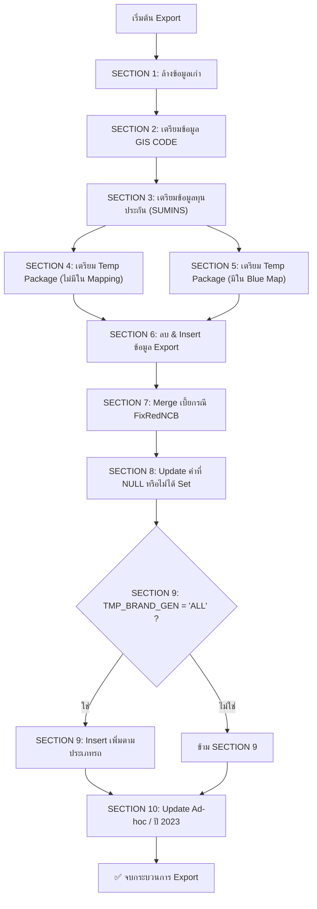

# 2002X Flowchart

**สรุป Flow การทำงานของ SQL Script Template Export File: `Template Export File  2002X`** 

แยกเป็นแต่ละ Section ตามลำดับขั้นตอน เพื่อให้เห็นภาพรวมอย่างชัดเจน:

#

### 🔁 **[SECTION 1] ล้างข้อมูลเดิม (DELETE Temp)**

- ลบข้อมูลเก่าใน Temp Table:
  - `TMP_EXP_BLUE_GIS_CODE_EV`
  - `TMP_EXP_BLUE_SUMINS_EV`
- เงื่อนไข: ไฟล์ `2002X(EV)` + รหัสแผนขาย (`pgSaleCode`) + ผู้ใช้งาน (`createBy`)

#

### 🧠 **[SECTION 2] ดึงข้อมูล GIS CODE → ลง Temp**

- INSERT ข้อมูลจาก `INS_BLUE_GIS_CODE` (รหัสรถ, ยี่ห้อ, กลุ่ม, spec ฯลฯ)
- Join กับ `INS_MB_FILE_HEADER` เพื่อกรองตามแผนขาย
- ใช้ `PM_BLUE_BOOK_DT` จาก `INS_MAPG_PREMIUM` เป็นเงื่อนไขสำคัญ

#

### 💰 **[SECTION 3] ดึงข้อมูลทุนประกัน (SUMINS) → ลง Temp**

- INSERT จาก `INS_BLUE_SUMINS` → Temp `TMP_EXP_BLUE_SUMINS_EV`
- เหมือนกับ GIS แต่ดึงช่วงทุน (Min/Cost/Max) และข้อมูลเบี้ย
- ใช้ `PM_BLUE_BOOK_DT` เช่นกัน

#

### 📦 **[SECTION 4] เตรียม Temp Package (กรณียังไม่มี Mapping)**

- ลบข้อมูลจาก `TMP_EXP_PACKAGE_2001_2_EV`
- INSERT จาก `INS_MAPG_PREMIUM`
  - เฉพาะรายการที่ **ไม่มี** ใน `INS_BLUE_MAP_BPSS2002`
  - และต้องมีใน `INS_MAIN_CONTROL`
- สรุป Min/Max/Avg ทุน แยกกลุ่มรถ

#

### 🔁 **[SECTION 5] เตรียม Temp Package (กรณีมี Mapping อยู่แล้ว)**

- INSERT Package ที่มี Mapping ใน `INS_BLUE_MAP_BPSS2002`
- เงื่อนไข join: Brand/Model/SubModel/Year/SumIns ต้องตรง

#

### 📤 **[SECTION 6] Export ข้อมูลจริง ลง INS_EXP_2002_XYZ**

- ลบข้อมูลเก่าใน `INS_EXP_2002_XYZ` ที่ `createBy` สร้างไว้
- INSERT ข้อมูลใหม่โดยใช้:
  - Join `INS_MAPG_PREMIUM` + `TMP_EXP_PACKAGE_2001_2_EV`
  - คำนวณ field เช่น:
    - Subclass
    - Pattern Rate
    - ทุน Default
    - ส่วนลดต่าง ๆ
    - EV Battery
    - Add Equip
    - Remark ฯลฯ

#

### 🧮 **[SECTION 7] MERGE → ปรับเบี้ยกรณี FixRedNCB**

- กรณีมี flag `RE-CAL(FixRedNCB)`
- จะ update ค่า `EXP_VOL_TOTAL` ด้วยสูตรที่ขึ้นกับ flag ของ R/C/D

#

### 🔧 **[SECTION 8] Update ค่าที่ยัง NULL หรือ Default**

- เช่น:
  - `EXP_FT = EXP_SUM_INS` ถ้าไม่มีอุปกรณ์
  - `EXP_VOL_TOTAL` = Net + Stamp + SvcTax
  - `EXP_BRAND_SALE`, `EXP_MODEL_SALE` ถ้า NULL → ให้ค่าว่าง

#

### 🚗 **[SECTION 9] กรณี TMP_BRAND_GEN = 'ALL' → Insert เพิ่มเติม**

- ใช้ GIS + SUMINS มาเติม Brand/Model ที่ยังไม่มี
- แยกตามประเภทรถ: Sedan, Pickup, Van
- สร้าง IBS_PUID ใหม่

#

### 🧩 **[SECTION 10] UPDATE ข้อมูลเฉพาะ Ad-hoc / ปี 2023**

- กรณีปี 2023:
  - เช็ค Default จาก `INS_BLUE_SUMINS_YEAR2023`
  - ถ้าไม่มี Default → flag `X` → หาตัวที่ทุนสูงสุดให้เป็น Default
  - Update เครื่องยนต์จาก GIS ปี 2023

#

## 🔄 Flow Summary (ภาพรวมลำดับการทำงาน)

1. ล้าง Temp ก่อนใช้งาน
2. เตรียมข้อมูล GIS + ทุน
3. เตรียมชุด Package ที่ต้อง Export
4. Insert ข้อมูล Export
5. แก้ไข/Update ตามเงื่อนไขพิเศษ
6. แก้ข้อมูลเพิ่มเติมกรณีพิเศษ หรือไม่ได้ใส่ข้อมูลครบ
7. Insert เพิ่ม ถ้าเลือก TMP_BRAND_GEN = 'ALL'
8. ปรับ Ad-hoc เฉพาะปี 2023 หรือกลุ่มเฉพาะ

#

